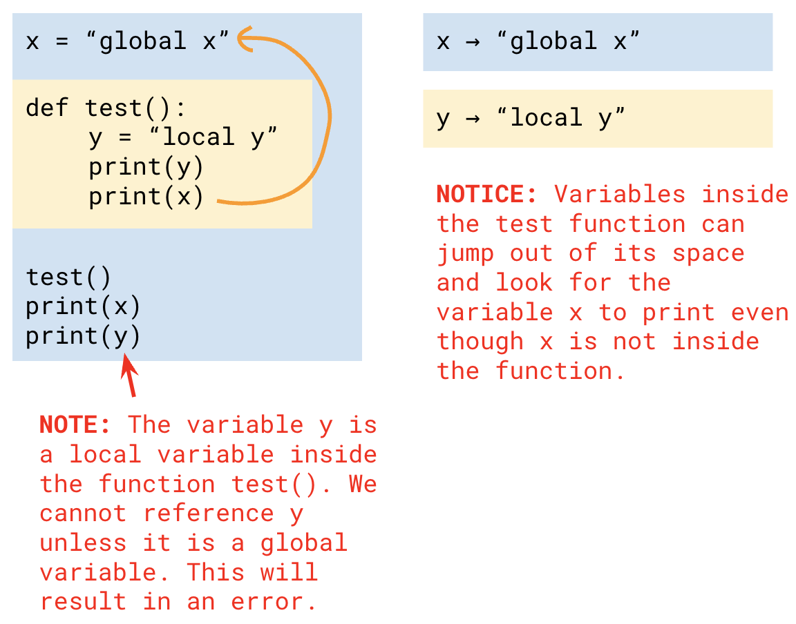
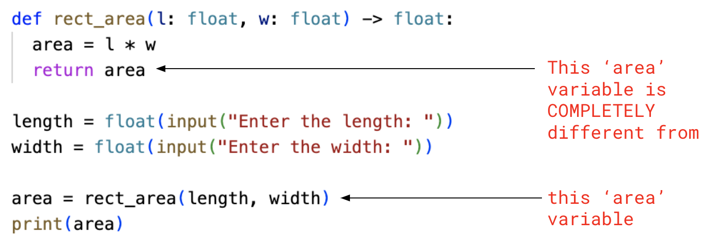

# 5.3 Variable Scope

>**Scope:** A variable's scope refers to where the variable exists within a program. If a variable doesn't exist at a certain place, then it is "out of scope".
- It determines where our variables can be accessed from within the program and what values those variables hold in different contexts.

There are two types of variable scopes:
1. Global variables
2. Local variables

## Local Scope & Variables
Local variables are variables that are defined within a function

## Global Scope & Variables
Global variables are variables defined at the top level of the program. This means it is defined at the beginning of programs outside and before all functions. This allows these variables to be used anywhere in the program.

## Demo:
```python
x = "global x"

def test():
  y = "local y"
  print(y)
  print(x) # We can print x here even if it doesn't exist in the test function

print(x)
print(y) # This does not work because y is defined INSIDE a function
```



## Example #1:
```python
x = 10
y = 5

def sum():
  x = 3
  print(x + y)

sum()
print(x + y)
```
```
OUTPUT:
8
15
```

<span style="color:red">
<b>Notes:</b><br>
- <code>print(x + y)</code> <b>inside</b> <code>sum()</code> will refer to local variables FIRST before global variables if it doesn't exist in the local scope. Therefore, inside <code>sum()</code>, <code>x = 3</code> (local variable) and <code>y = 5</code>(global variable: y is not inside function, so looks outside the function)<br>
- <code>print(x + y)</code> <b>outside</b> the function will only refer to <b>global variables</b>. Therefore <code>x = 10</code> and <code>y = 5</code>
</span>

## Example #2:
### Same variable name in local and global scope

Here was the area of a rectangle function we have used previously:
```python
def rect_area(l: float, w: float) -> float:
  area = l * w
  return area

length = float(input("Enter the length: "))
width = float(input("Enter the width: "))

area = rect_area(length, width)
print(area)
```
